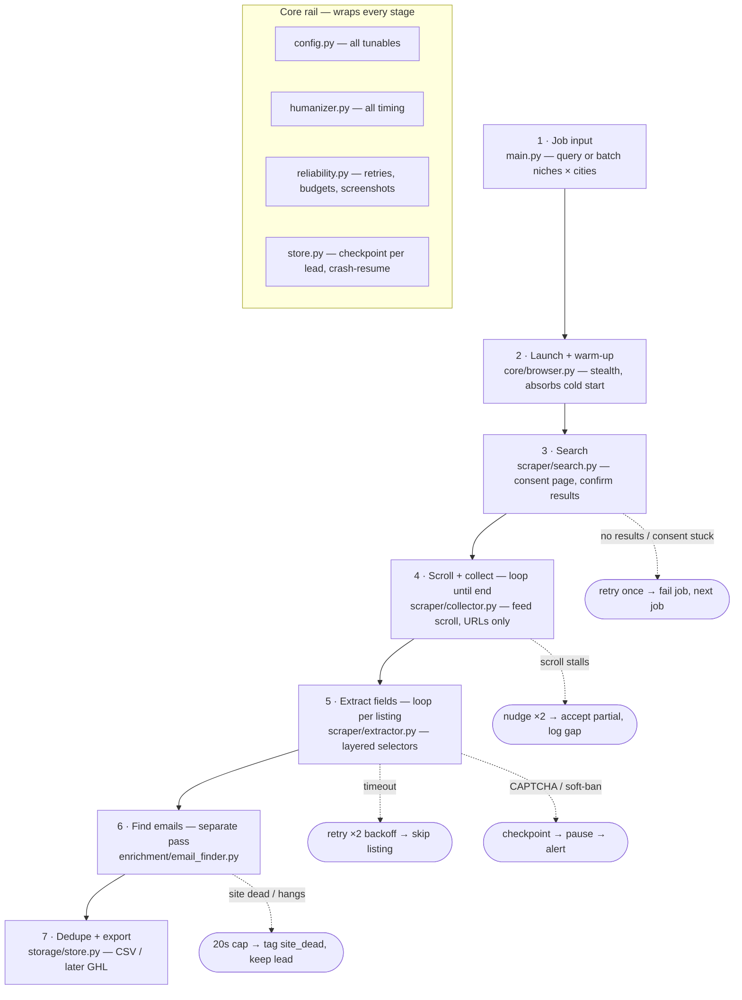

# Google Maps Lead Scraper — Module Plan

**Goal:** Free, reliable lead-generation pipeline. Phase 1: scrape Google Maps leads with Playwright
(name, category, address, phone, website, rating, reviews) + enrich with emails from business websites.
Phase 2 (later): outreach sequences (likely via GoHighLevel).

## Architecture

```
google-maps-scraper/
├── main.py               # CLI + orchestrator (single query or batch niches × cities)
├── config.py             # ALL tunables: timeouts, delay ranges, retries, selectors
├── core/
│   ├── browser.py        # launch + stealth patches + warm-up before handing control
│   ├── humanizer.py      # centralized randomized delays, reading pauses, mouse moves
│   └── reliability.py    # retry w/ backoff, per-action timeout budgets, error taxonomy,
│                         #   failure screenshots to logs/
├── scraper/
│   ├── search.py         # build Maps URL, handle consent page, confirm results loaded
│   ├── collector.py      # scroll div[role="feed"], detect true end-of-list, output URLs only
│   └── extractor.py      # per-listing field extraction; layered selectors (aria/role first,
│                         #   class names as fallback); missing field = warning, never crash
├── enrichment/
│   └── email_finder.py   # separate pass: homepage → mailto/regex → /contact, /about, footer;
│                         #   score emails; tag email_found / no_email / site_dead
├── storage/
│   └── store.py          # SQLite (write-as-you-go, stage status: collected→extracted→enriched,
│                         #   dedupe on phone/website/place-ID) + CSV/Excel export
└── logs/                 # run logs + failure screenshots
```

## Logging standard (applies to EVERY feature, small or big)

Built in core/logbook.py. Non-negotiable going forward: every new module logs
through it — no bare `print()`, no silent failures. The rule is "if it happens,
it's in the log."

- **Two outputs.** Console = clean, plain-language, for the operator (INFO+).
  File = `logs/<timestamp>-<query>.log`, full detail (DEBUG+): timestamps,
  module names, levels, every breadcrumb, and complete tracebacks.
- **How to use in a module:**
  `from core.logbook import get_logger` then `log = get_logger(__name__)`.
  - `log.info(...)`  → operator sees it (keep it friendly, plain words)
  - `log.debug(...)` → file only (counts, timings, selector hits, decisions)
  - `log.warning(...)` → console gets a `[warn]` tag + file
  - `log.exception(...)` → console stays calm; file gets the FULL traceback
- Every failure screenshot path is logged so the file and the image correlate.
- Console is forced to UTF-8 so dashes/quotes render (no mojibake).
- `main.py` calls `setup_logging(query)` once at startup and prints the log
  path at the end so the operator always knows where the detailed record is.

## Reliability rules (from Selenium lessons learned)

- Condition-based waits only — no fixed sleeps in logic; Playwright auto-wait + explicit
  "wait until feed has results" conditions.
- Per-action timeout budgets: click 10s, page load 30s, scroll step 15s. Fail fast → retry.
- Warm-up in browser.py absorbs cold-start slowness before scraping begins.
- All timing goes through humanizer.py (randomized 1.5–3.5s scroll delays; research showed
  fast scrolling soft-bans in minutes, 2–4.5s jitter survives 200+ listings).
- Pace target: ~1 listing / 4–8s → ~300–500 leads/day from one home IP, safely.
- CAPTCHA / soft-ban detection → checkpoint + pause + alert, never push through.
- Crash-resume: SQLite checkpoint per lead; restart continues where it stopped.
- Headed browser by default (less detectable, watchable).

## Build order

1. browser + search + collector → listing URLs reliably
2. extractor + store → real leads in SQLite/CSV
3. reliability + humanizer hardening → survives long runs
4. email_finder → contactable leads
5. main batch mode → niches × cities fleets

## Pipeline flow



Every stage writes to SQLite before the next begins (status: collected → extracted → enriched),
so a crash resumes exactly where it stopped.

## Known Google-side behaviors (discovered in live testing)

- **New Maps UI (region-dependent, seen 2026-07):** search box is `input[name="q"]`,
  not the classic `#searchboxinput`. Handled via fallback selector chain.
- **Sign-in wall truncation:** logged-out sessions intermittently get a "Sign in to get
  the most out of…" prompt that caps the feed early (~95 of ~120 results). SOLVED via a
  persistent Chrome profile with a one-time manual burner-account login (login.py +
  PROFILE_DIR). Confirmed: signed-in runs no longer show the wall.
- **IP rate throttling (distinct from the wall):** after heavy same-day scraping from one
  IP, Google hard-caps how far the feed will page (observed: clean climb then a dead stop
  at ~56, immune to nudges/cooldown). Login does NOT fix this — it's IP-bound. Mitigation
  belongs in Milestone 4: cooldowns between runs + a sane daily cap. Verify the login's
  full-count benefit only after an IP cooldown, not right after a heavy test session.

## Key selectors (verify before each build phase — Google shuffles class names)

- Results feed: `div[role="feed"]`
- Result card: `div[role="article"]` (fallback: `a[href*="/maps/place/"]`)
- End of list: "You've reached the end of the list" text
